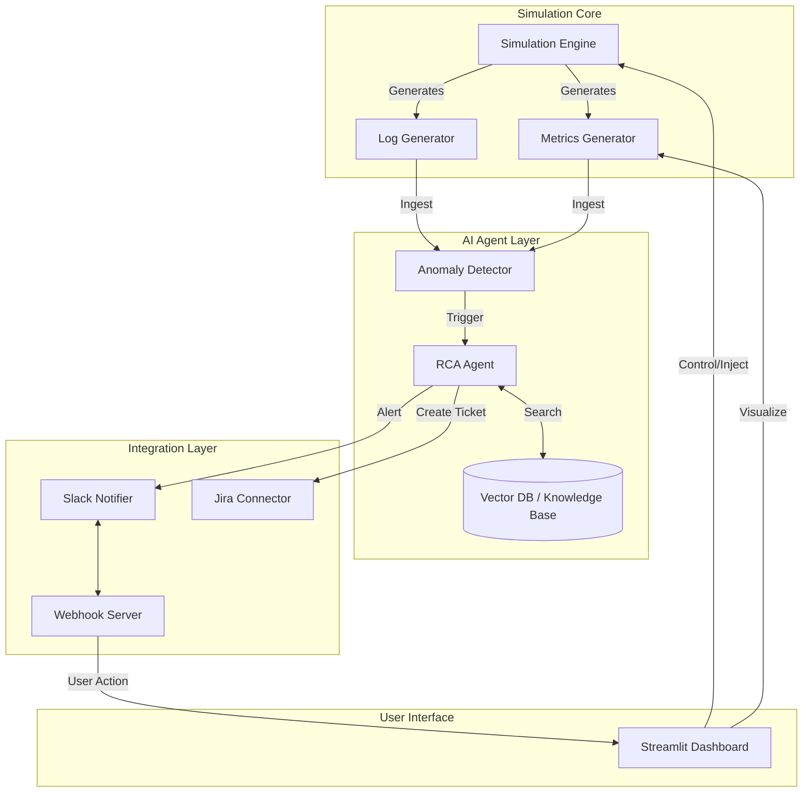

# OPS Agent Project Explanation

## 1. Project Overview
The **OPS Agent** is an AI-driven Operational Support Agent designed to simulate, detect, analyze, and resolve production incidents. It acts as an autonomous "Site Reliability Engineer" (SRE) that monitors system health, detects anomalies, identifies root causes using RAG (Retrieval-Augmented Generation), and executes recovery actions upon human approval (via Dashboard or Slack).

## 2. Architecture & Workflow

### High-Level Workflow
1.  **Simulation**: The system generates synthetic application logs and metrics (CPU, Memory, Latency) to simulate a real production environment.
2.  **Detection**: Anomaly detection logic identifies issues (e.g., "High CPU", "Log Errors").
3.  **Analysis (Agent)**: The **RCA Agent** analyzes the incident using:
    -   **Rule-based Heuristics**: Immediate symptom checking.
    -   **RAG (Vector DB)**: Searches a knowledge base of historical incidents to find similar past issues and recommended fixes.
4.  **Notification**: The agent sends alerts to **Slack** and creates tickets in **Jira**.
5.  **Human-in-the-Loop**:
    -   A human reviews the proposed action on the **Dashboard** or **Slack**.
    -   If Approved -> The Agent executes a "Recovery Playbook" (e.g., Restart Service, Scale Up).
    -   If Denied -> The ticket is escalated to L3 support.

### System Architecture Diagram

## 3. Technologies Used

| Technology | Role | Description |
| :--- | :--- | :--- |
| **Python** | Core Language | The entire backend, simulation, and agent logic are written in Python. |
| **Streamlit** | Dashboard (Frontend) | Renders the real-time UI, metrics charts, and incident management console. It drives the main simulation loop in this demo setup. |
| **Flask** | Webhook Server | A lightweight web server running on port 3000 to receive incoming webhooks from Slack (e.g., when a user clicks "Approve"). |
| **LangChain** | AI Frameowrk | Used to manage the RAG pipeline and interactions with the Knowledge Base. |
| **ChromaDB** | Vector Database | Stores embeddings of historical incidents (Knowledge Base) to allow semantic searching for RAG. |
| **Plotly** | Visualization | Used by Streamlit for rendering interactive metric charts. |
| **PyNgrok** | Tunneling | Exposes the local Flask server to the public internet so Slack can reach it. |
| **Jira API** | Ticketing | Python `jira` library used to create and update tickets in a real Jira project. |
| **Slack SDK** | Messaging | Used to post rich interactive messages to Slack channels. |

## 4. Detailed Component Breakdown

### A. Simulation Engine (`src/simulation`)
-   **`engine.py`**: The "brain" of the simulation. It runs a `tick()` loop that advances time.
-   **`metrics_generator.py`**: Produces synthetic metrics (CPU, Memory, Disk) with optional noise and anomaly patterns (e.g., linear increase for memory leak).
-   **`logs_generator.py`**: Generates realistic-looking app logs (INFO, ERROR, WARN) including stack traces during incidents.
-   **`state.py`**: Tracks the state of all incidents (active, resolved, escalated).

### B. RCA Agent (`src/agent/rca_agent.py`)
-   **Logic**: When an incident is detected, the agent:
    1.  Aggregates symptoms (e.g., "Latency > 2s", "ConnectionRefusedError").
    2.  Queries **ChromaDB** for similar past incidents.
    3.  Scores hypotheses based on similarity confidence.
    4.  Proposes the top-ranked solution.
-   **Knowledge Base**: A JSON file (`data/historical_incidents.json`) loaded into the Vector DB at startup.

### C. Webhook Server (`src/integration/webhook_server.py`)
-   **Purpose**: Slack cannot talk to `localhost` directly.
-   **Flow**:
    1.  User clicks "Approve" in Slack.
    2.  Slack sends POST request to the **Ngrok** public URL.
    3.  Ngrok forwards to local Flask app (Port 3000).
    4.  Flask app writes the action to `data/pending_actions.json`.
    5.  Streamlit Dashboard polls this file and executes the approval.

### D. Dashboard (`dashboard/app.py`)
-   **Visualization**: Graphs for system health.
-   **Control**: Buttons to manually inject chaos (e.g., "Inject High CPU").
-   **Console**: A "Chaos Terminal" that shows internal logs and allows command-line interaction.

## 5. How to Answer Questions about this Project

**Q: How does the AI know what to do?**
A: It uses **RAG (Retrieval-Augmented Generation)**. It looks at the current error symptoms and searches a vector database of *past* solved incidents to find the best match. It doesn't just "guess"; it relies on historical organizational knowledge.

**Q: How does Slack talk to my local machine?**
A: We use **Ngrok** to create a secure tunnel. Slack sends data to the public Ngrok URL, which pipes it to our local Flask server.

**Q: What happens if I click "Approve"?**
A: The approval is captured by the Webhook Server, stored in a pending queue, and picked up by the Simulation Engine. The Engine then runs a specific **Recovery Playbook** (a Python script) tailored to that incident type (e.g., "Restart Service" for a "Service Down" incident).

**Q: Is the data real?**
A: In this demo, the data is **synthetic** (generated by `metrics_generator.py`), but the *processes* (Jira ticket creation, Slack alerting, RAG analysis) are real and functional.
